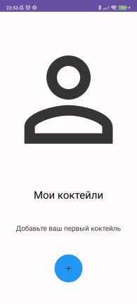
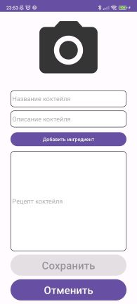
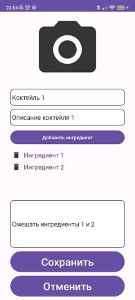
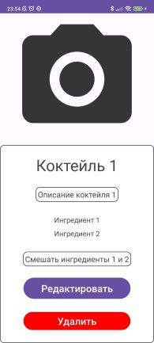
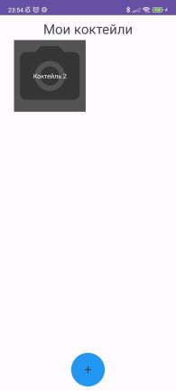

# Cocktail Bar #
### Android-приложение, созданное в процессе обучения в Летней Android-школе от компании Surf

**1. Объем фичей**\
*Выполненные основные задания:*
+ Экран "Мои коктейли"
+ Экран добавления первого коктейля
+ Экран "Создание коктейля"
+ Экран "Деталка коктейля"

*Невыполненные основные задания:*
+ Отсутствуют

*Выполненные дополнительные задания:*
+ Удаление коктейля
+ Изменение коктейля

*Невыполненные дополнительные задания:*
+ Картинка для коктейля
+ Шаринг списка коктейлей
+ Картинка для FAB

**2. Технические детали:**
+ Для хранения данных используется SharedPreferences из-за небольшого объема сохраняемых данных
+ Передача данных между Activity происходит посредством Intent
+ Передаваемые данные - название коктейля, его описание, ингредиенты, рецепт. Название обязательное, остальные - опциональные
+ Поиск и удаление информации о коктейлях происходит по названию коктейля - таким образом, в сохраненных данных не может быть двух коктейлей с одинаковыми названиями. Также название коктейля выступает как своего рода ID
+ Для отображения массивов данных на экране (список ингредиентов, список сохраненных коктейлей) используется RecyclerView. В случае со списком сохраненных коктейлей linearLayoutManager установлен как GridLayoutManager с двумя столбцами
+ Для связи нажатия кнопки удаления ингредиента в адаптере RecyclerView и удаления соответствующего элемента из массива в окне создания нового коктейля используется Interface

**3. Скриншоты и видео работы приложения**
+ Окно создания первого коктейля (сохраненных коктейлей нет)
+ 
+ Окно создания нового коктейля
+ 
+ Окно создания нового коктейля, заполненное
+ 
+ Окно сохраненных коктейлей
+ 
+ Просмотр информации о коктейле 1
+ 
+ Редактирование информации о коктейле 1
+ 
+ Сохраненная отредактированная информация
+ 
+ Видеодемонстрация работы приложения
+ 
